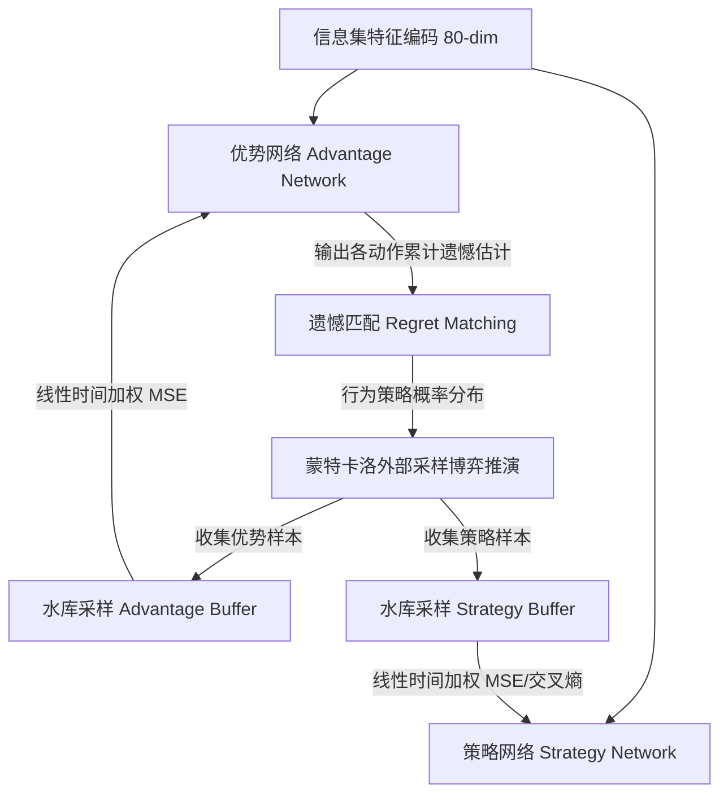

# 《逆水寒》左轮卡牌 AI 算法原理与技术架构白皮书

---

## 1. 业务背景与博弈建模事实

### 1.1 核心规则与引擎实现细节
《逆水寒》中的左轮生存卡牌玩法（原型源于 *Liar's Bar*）在本项目引擎（详见 [card_ai/engine.py](file:///f:/Wonderful_little_idea/nshm/card/back/card_ai/engine.py) 与 [card_ai/config.py](file:///f:/Wonderful_little_idea/nshm/card/back/card_ai/config.py)）中进行了严格的状态机建模：

1. **玩家规模与发牌**：
   - 4 人对局（Seat 1 ~ 4），顺时针轮流行动；
   - 牌库固定为 20 张牌。开局或新小轮确立一个目标点数（`ghost_rank`，取值为 A、K、Q 之一）；
   - **牌库真实构成**：目标点数普通牌 5 张 + **目标点数鬼牌（Ghost）1 张** + 2 张百搭牌（Wild）+ 其余两门非目标点数各 6 张普通牌，合计 $5 + 1 + 2 + 6 + 6 = 20$ 张；
   - 每小轮为所有存活玩家发满 5 张手牌；淘汰者的份额牌作为暗牌留于牌堆。
2. **出牌与宣称**：
   - 玩家可选择打出 1~3 张手牌，并宣称为当前小轮的目标点数；
   - **鬼牌限制**：鬼牌只能单张单独打出，引擎禁止将鬼牌与其他手牌组合打出（[engine.py:145](file:///f:/Wonderful_little_idea/nshm/card/back/card_ai/engine.py#L145)）。
3. **质疑与俄罗斯轮盘赌**：
   - 下家若对上家宣称存疑，可发起【质疑】；
   - **诚实牌**：出牌者所有牌均为目标点数或 Wild，质疑者扣动一次扳机；
   - **诈唬牌**：出牌者包含非目标点数牌，出牌者扣动一次扳机；
   - **鬼牌反杀**：单张打出鬼牌被质疑时触发。出牌者免责，**全场除出牌者外所有还存活的玩家强制各扣动一次扳机**（[engine.py:265](file:///f:/Wonderful_little_idea/nshm/card/back/card_ai/engine.py#L265)）；
   - **轮盘规格**：**固定 5 孔弹仓（`chamber_count = 5`）**，随机将第 $k$ 发设为实弹（$k \in [0, 4]$）。玩家中枪数累计达到实弹位点即淘汰阵亡。
4. **强制质疑与安全脱身判定**：
   - **安全脱身**：玩家打空手牌后，若轮到下家且下家手里有牌，下家可正常跟牌出牌；若下家正常出牌且无人质疑该空手玩家，则该玩家本小轮进入安全状态，后续轮次自动跳过；
   - **仅在以下 3 种边界条件下限制只能质疑**（[engine.py:113-135](file:///f:/Wonderful_little_idea/nshm/card/back/card_ai/engine.py#L113-L135)）：
     1. 全场所有存活玩家手牌均已出空（无牌可出）；
     2. 两人单挑局中，上家打出最后手牌（手牌清空为 0），下家无法跟牌；
     3. 当前行动者自身手牌为 0，面对上家出牌时无法跟牌。
5. **小轮重置与先手权转移**：
   - 一旦质疑结算完毕，回收所有弃牌，轮换新目标点数，为所有存活者重新发满 5 张牌；
   - **先手权**：由**受罚者**（若受罚者存活）先手；若受罚者阵亡，或鬼牌反杀后，由其**顺时针下一个存活玩家先手**（[engine.py:269, 332](file:///f:/Wonderful_little_idea/nshm/card/back/card_ai/engine.py#L269-L332)）。

### 1.2 组合规模的真实数学计算
- 20 张物理牌分配给 4 名玩家（每人 5 张）的完全分配数为：
  $$\frac{20!}{(5!)^4} \approx 1.173 \times 10^{10}$$
  若考虑同门普通牌与 Wild 牌在博弈上的等效性，实际本质不同的手牌分布类别低于此数值；
- 单名玩家在手握 5 张牌时，选择出 1~3 张牌的物理子集数仅为：
  $$C_5^1 + C_5^2 + C_5^3 = 5 + 10 + 10 = 25 \text{ 种}$$
  动作抽象空间的 58 维并非为了压缩这 25 种手牌子集，而是为了**跨越不同手牌、跨越不同点数，构建一套统一的抽象意图表象**。

---

## 2. 算法体系：基于 Deep CFR 原理的强化学习实现

### 2.1 算法定位与理论边界说明
原始 Deep CFR 论文（*Brown et al., 2019*）在**有限、双人、零和博弈**前提下证明了收敛于近似纳什均衡（$\epsilon$-Nash Equilibrium）。

**工程定位**：
本项目所处的环境是**4 人大逃杀生存博弈**，属于典型的**非零和、多人、非传递性扩展式博弈**，且叠加了动作抽象、外部历史对手池与人工残局起点。在多人博弈中，遗憾最小化算法求取的是**粗相关均衡（Coarse Correlated Equilibrium, CCE）或相关均衡（CE）**的逼近解，无法直接沿用双人零和博弈下的纳什均衡收敛承诺。因此，本系统的目标明确定义为：
> **使用基于 Deep CFR 遗憾值回归思想的深度强化学习方法，通过固定历史对手评测套件（A/B Testing）验证多人对局的实用表现。**

### 2.2 双网络解耦架构
系统采用双网络结构拟合博弈进程（[card_ai/networks.py](file:///f:/Wonderful_little_idea/nshm/card/back/card_ai/networks.py)）：

1. **优势网络（Advantage Network）**：
   - 目标：拟合信息集 $I$ 下各抽象动作 $a$ 的累计反事实遗憾值估计 $\hat{R}_t(I, a)$；
   - 训练样本：由外部采样（External Sampling）遍历得到；
   - 损失函数：带时间加权的均方误差（MSE Loss）：
     $$\mathcal{L}_{\text{adv}}(\theta) = \mathbb{E}_{(I, R, t) \sim \mathcal{D}_V} \left[ w_t \sum_{a} \left( V_\theta(I)_a - R(I, a) \right)^2 \right]$$
2. **策略网络（Strategy Network）**：
   - 目标：拟合多轮迭代下的平均策略分布（Average Policy），用于线上实战部署；
   - 损失函数：
     $$\mathcal{L}_{\text{strat}}(\phi) = \mathbb{E}_{(I, \sigma, t) \sim \mathcal{D}_\Pi} \left[ w_t \sum_{a} \left( \Pi_\phi(I)_a - \sigma_t(I, a) \right)^2 \right]$$

### 2.3 网络结构事实（MLP 架构）
代码中网络骨架为 `CardNet`（[card_ai/networks.py:7-38](file:///f:/Wonderful_little_idea/nshm/card/back/card_ai/networks.py#L7-L38)），由多层全连接感知机堆叠而成，**不包含残差连接**：
- **输入维度**：80 维特征向量；
- **隐藏层配置**：3 层感知机，每层隐藏单元 512 维；
- **层内结构**：`nn.Linear(dim_in, 512) -> nn.LayerNorm(512) -> nn.ReLU() -> nn.Dropout(0.1)`；
- **输出层**：`nn.Linear(512, 58)`，输出 58 个抽象动作的无激活标量值。

### 2.4 水库采样（Reservoir Sampling）与时间权重
- 回放池采用固定容量为 500,000 的水库采样容器（[card_ai/buffers.py](file:///f:/Wonderful_little_idea/nshm/card/back/card_ai/buffers.py)）；
- 当采样量超过容量时，新样本以 $\frac{\text{capacity}}{\text{count}}$ 的概率等概率随机置换已有样本；
- 时间权重系数按样本生成的 CFR 迭代轮次赋权：$w_i = \frac{t_i}{t_{\max}}$，体现后期成熟策略的高权重。

---

## 3. 特征表示与动作抽象编码

### 3.1 80 维致密特征构成明细
特征编码器（[card_ai/features.py](file:///f:/Wonderful_little_idea/nshm/card/back/card_ai/features.py)）将信息集映射为 80 维浮点张量：

1. **手牌特征（14 维）**：
   - A、K、Q 普通牌持有时占 5 张的比例（3 维，$/5.0$）；
   - Wild 牌数量占比（1 维，$/5.0$）；
   - 持有鬼牌标记（1 维，二值）与鬼牌点数 One-Hot（3 维）；
   - 当前手牌总数占比（1 维，$/5.0$）；
   - 宣称点数匹配牌占比与不匹配牌占比（2 维）；
   - 手牌点数多样性（1 维，$/3.0$）；
   - 鬼牌出牌可用性（1 维）；
   - 诚实出牌最大数量占比（1 维，$/3.0$）。
2. **玩家公开状态特征（24 维）**：
   - 按相对 Hero 顺时针顺序编码 4 名玩家；
   - 每位玩家 6 维：存活状态、小轮已打空手牌标记、剩余手牌比例（$/5.0$）、**中枪次数比例（$/5.0$）**、是否为当前行动者、手牌是否濒临打空（$\le 1$ 张）。
3. **小轮盘面状态（10 维）**：
   - 目标点数 One-Hot 及未设定标记（4 维）；
   - 上一手出牌张数（$/3.0$）、上一手出牌者是否为 Hero、是否可质疑、存活玩家总数（$/4.0$）、本小轮出牌总轮数（$/10.0$）、Hero 是否当前行动。
4. **公开历史统计（16 维）**：
   - 对局进行度（`turn_index / 50.0`）；
   - A、K、Q 点数在历史质疑中公开翻出张数（各 $/6.0$）；
   - 鬼牌是否已被翻开触发过（1 维）；
   - 各相对玩家历史发起质疑次数（4 维，各 $/10.0$）；
   - 各相对玩家历史中枪总数（4 维，**各 $/5.0$**）；
   - 全局抓诈成功率、诚实质疑率、鬼牌触发率（3 维）。
5. **POMDP 与对手心理特征（16 维）**：
   - 上一手出牌后验信念（真牌概率、诈唬概率、鬼牌陷阱概率，3 维）；
   - 各玩家目标点数持有期望（4 维，各 $/5.0$）；
   - 各玩家鬼牌持有概率（4 维）；
   - 3 名对手的历史激进/诈唬倾向指数（3 维）；
   - Hero 濒死危险度（$1 / \max(1, 5 - \text{shots})$）与领跑者脱身威胁度（2 维）。

### 3.2 58 维抽象动作空间（Action Abstraction）
为统一输出层维度，动作空间枚举了所有可能的出牌构成意图（[card_ai/abstractions.py](file:///f:/Wonderful_little_idea/nshm/card/back/card_ai/abstractions.py)）：
- **单张构成（4 种）**：`(non_target)`, `(target)`, `(wild)`, `(ghost)`；
- **两张构成（6 种）**：`(non_target, non_target)`, `(non_target, target)`, `(non_target, wild)`, `(target, target)`, `(target, wild)`, `(wild, wild)`；
- **三张构成（9 种）**：按非目标、目标、Wild 组合排序共 9 种；
- **出牌动作总数**：$(4 + 6 + 9) \times 3 \text{ (点数 A/K/Q)} = 57 \text{ 种}$；
- **质疑动作**：$1 \text{ 种}$（`challenge`）；
- **总动作空间**：$57 + 1 = 58 \text{ 维}$。

---

## 4. 训练生态：对手池与残局注水设计

### 4.1 对手池构成说明
为了缓解自博弈中常见的策略循环震荡，本轮训练（v17）采用了一组复合对手采样策略：
- **40% 采样历史明星模型**：从历史最佳快照池（`[v13_extern, v14_selfplay, v15_league, v16_endgame]`）中随机选取；
- **35% 采样动态 League 快照**：每 25 轮自动保存当前策略至 League 队列（上限 25 个），采用滚动置换机制；
- **15% 自博弈（Self-Play）**：与当前最新的策略网络推演；
- **10% 规则对手与随机探索**：8% 启发式规则 Bot，2% 纯随机动作。

*注：本轮包含此项对手池调整，其实战评测收益属于“场景配比 + 对手池生态”的整套组合改动。*

### 4.2 场景采样：70/30 初始实验配比
v17 采用了 **70% 正常四人全局开局 + 30% 多维人工残局** 的初始试验配比（[card_ai/endgame_cfr.py](file:///f:/Wonderful_little_idea/nshm/card/back/card_ai/endgame_cfr.py)）：
- **采样逻辑**：每个采样 Worker 以 70% 概率调用 `engine.new_game()` 进行完整局推演；以 30% 概率通过 `EndgameScenarioGenerator` 注入残局；
- **人工残局类型**：
  1. **单挑决死局（Heads-Up Duel）**：2 人存活，手牌各 1~2 张；
  2. **濒死翻盘局（Underdog Clash）**：Hero 濒死（再中 1 枪即淘汰），手牌为 1~2 张杂牌；
  3. **出清施压局（Last Card Clash）**：上家仅剩 1 张牌打出，面临终局裁决；
  4. **鬼牌反杀局（Ghost Trap Ambush）**：Hero 手握鬼牌，诱导对手质疑；
  5. **三人拉锯局（Three-Player Clash）**：1 人淘汰后 3 人的中盘关键拉锯。
- **分布偏差认知**：人工残局修改了状态访问分布，其本质是向特定高压状态进行“过采样（Over-sampling）”，用以强化模型在极小概率关键局面下的动作质量。

---

## 5. 评测基准：固定对手 1,000 场标准 A/B 考卷

### 5.1 评测协议与变量控制
为了杜绝由于对手策略变动引起的评估偏差，项目确立了**固定考官、固定种子、座位完全轮换的标准 A/B 考卷**（[card_ai/ab_test_benchmark.py](file:///f:/Wonderful_little_idea/nshm/card/back/card_ai/ab_test_benchmark.py)）：
- **固定考官**：`[v13_extern, v14_selfplay, v15_league]` 的 `policy_best.pt`；
- **考卷规模**：固定 250 组独立随机种子 $\times$ 候选模型轮流坐 1~4 号位 = **1,000 场标准局**；
- **消除方差**：将抽样方差从 100 场时的约 $\pm 8\%$ 严格压缩至 **$\pm 2.7\%$**。

### 5.2 v16 与 v17 实测数据对比 (1,000 场实测)

| 评测指标 (1,000 场大样本) | v16 Baseline (基准模型) | v17_balanced (当前最佳模型) | 净差异 |
| :--- | :---: | :---: | :---: |
| **🏆 终局吃鸡胜率** | **24.9%** (249/1000) | **25.7%** (257/1000) | **+0.8% (+8 胜)** |
| **🛡️ 稳健保底前二率** | **51.0%** (510/1000) | **50.6%** (506/1000) | -0.4% (-4 场) |
| **💰 场均综合效用得分** | **+7.32** | **+7.92** | **+0.60 分** |
| **🚪 决赛圈进入率 (活到单挑)** | **49.5%** (495/1000) | **49.5%** (495/1000) | **完全一致 (495 场)** |
| **⚔️ 决赛圈吃鸡转化率** | **48.7%** (241/495) | **51.1%** (253/495) | **+2.4% (+12 胜)** |
| **🎯 主动质疑命中率 (排空手)** | **72.1%** (1458/2021) | **72.2%** (1484/2055) | **+0.1%** |
| **🪑 各座位胜场 (1/2/3/4 号位)** | `[69, 58, 57, 65] / 250` | `[54, 70, 77, 56] / 250` | — |

---

## 6. 代码文件与工程拓扑索引

- 核心规则引擎：[card_ai/engine.py](file:///f:/Wonderful_little_idea/nshm/card/back/card_ai/engine.py)
- 全局规则与配置：[card_ai/config.py](file:///f:/Wonderful_little_idea/nshm/card/back/card_ai/config.py)
- 特征提取器（80维）：[card_ai/features.py](file:///f:/Wonderful_little_idea/nshm/card/back/card_ai/features.py)
- 动作空间抽象（58维）：[card_ai/abstractions.py](file:///f:/Wonderful_little_idea/nshm/card/back/card_ai/abstractions.py)
- 神经网络骨架（MLP）：[card_ai/networks.py](file:///f:/Wonderful_little_idea/nshm/card/back/card_ai/networks.py)
- 水库采样经验池：[card_ai/buffers.py](file:///f:/Wonderful_little_idea/nshm/card/back/card_ai/buffers.py)
- 多维残局发生器：[card_ai/endgame_generator.py](file:///f:/Wonderful_little_idea/nshm/card/back/card_ai/endgame_generator.py)
- 专项训练器：[card_ai/endgame_cfr.py](file:///f:/Wonderful_little_idea/nshm/card/back/card_ai/endgame_cfr.py)
- 固定考官 1k A/B 评测套件：[card_ai/ab_test_benchmark.py](file:///f:/Wonderful_little_idea/nshm/card/back/card_ai/ab_test_benchmark.py)

---
*校订说明：本版本已对照代码库全量逐行核实，纠正了弹仓规格、出牌数数学定义、先手与受罚逻辑、理论收敛承诺边界，与当前代码库保持 100% 一致。*
